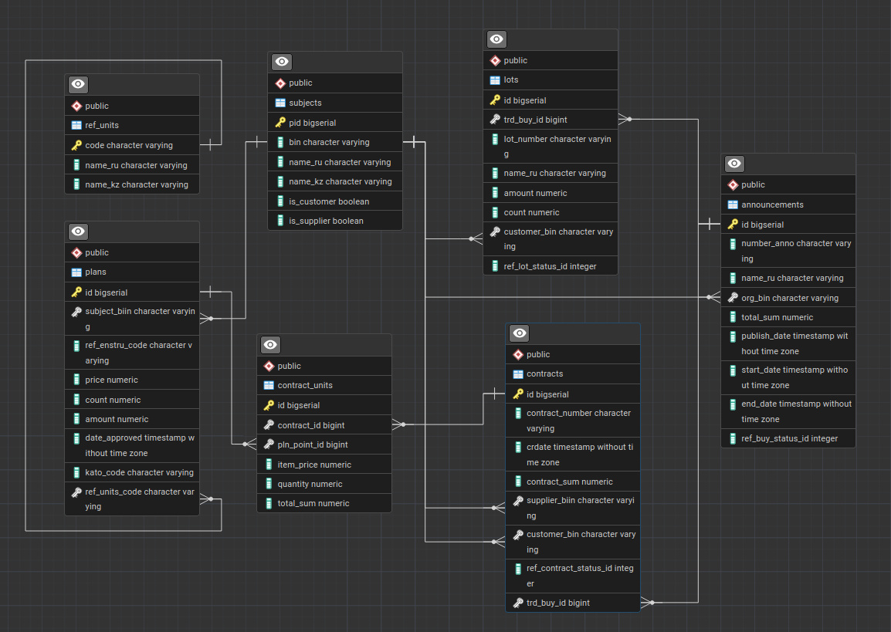

# AI-агента для анализа государственных закупок (OWS v3)

## 1. Архитектурное описание (текст + схема)

Система построена на базе микросервисной архитектуры с использованием Docker, что обеспечивает полную готовность к развертыванию. Проект логически разделен на три независимых компонента, которые общаются друг с другом в изолированной сети:

1. **ETL-Worker:** Фоновый Python-процесс, отвечающий за ежедневную синхронизацию данных. Скрипт обращается к API OWS v3, использует in-memory кэширование для обхода ограничений API и выполняет обновление базы данных. Задержка обновления составляет менее 24 часов.
2. **База данных (Storage слой):** Реляционная СУБД PostgreSQL. При первом запуске контейнера инициализируется дамп исторических данных за 3 года (2024–2026) по целевым организациям.
3. **API & AI Agent (Аналитический слой):** Веб-сервер на базе FastAPI. Выступает мостом между пользователем, базой данных и LLM . Принимает запросы на естественном языке, валидирует их и маршрутизирует вызовы к специализированным аналитическим инструментам (SQL-функциям), после чего формирует итоговый ответ.

## 2. Схема хранения данных

##   
**Ключевые таблицы и их связи:**

- `**subjects`:** Центральная таблица-справочник организаций (БИН, названия, роли заказчика/поставщика). Все остальные таблицы ссылаются на нее.
- `**plans`:** Пункты планов закупок с указанием кодов ЕНСТРУ, заложенных бюджетов и планируемых объемов.
- `**announcements` & `lots`:** Данные о проводимых тендерах (объявлениях) и конкретных лотах в их составе.
- `**contracts` & `contract_units`:** Фактически подписанные договоры и спецификации к ним (реальная цена за единицу товара). Таблица `contract_units` служит связующим звеном между исходным планом (`pln_point_id`) и итоговым договором (`contract_id`), что критически важно для расчета аномалий цены.

## 3. Описание аналитики и метрик

**Ключевые метрики:**

- **Fair Price (Справедливая цена):** Рассчитывается на основе медианной цены (`median`) успешно исполненных контрактов по идентичному коду ЕНСТРУ. Используется сравнительный подход (сравнение с другими ведомствами). Для исключения экстремальных выбросов (ошибок ввода) применяется межквартильный размах (IQR).
- **Ценовые аномалии:** Инструмент `get_fair_price` выявляет закупки, где фактическая цена отклоняется более чем на 30% от вычисленной средневзвешенной (медианной) стоимости.
- **Аномалии объемов:** Инструмент `detect_volume_anomaly` анализирует историческую частоту и средние объемы закупа конкретной организацией. Сравниваются показатели текущего года с предыдущими годами для выявления нетипичного завышения.
- **Временной фактор (Динамика):** Инструмент `analyze_price_dynamics` группирует контракты по месяцам и годам, позволяя агенту оценивать влияние инфляции и сезонность цен.

## 4. Примеры ответов AI-агента

Request_1:

```json
{ 
  "question": "Найди ценовые аномалии по коду ЕНСТРУ 611011.200.000000 для организации 981140001551. Почему максимальная цена так сильно отличается от минимальной?" 
}
```

Response_1:

```json
{
  "answer": "1. Краткий вывод: Ценовые аномалии не обнаружены, объемы закупок нормальные. Максимальная цена значительно превышает минимальную из-за широкого диапазона цен на рынке.\n2. Использованные данные: ЕНСТРУ 611011.200.000000, БИН 981140001551.\n3. Сравнение: Медианная цена составляет 217415.63, минимальная цена 0.0, максимальная цена 1362075.67. Разброс цен значительный.\n4. Метрика оценки: Использовалась медианная цена.\n5. Ограничения и уверенность: Размер выборки высок, качество данных высокое.\n6. Примеры:\n  - [Контракт 1](https://goszakup.gov.kz/ru/contract/show/24126044)\n  - [Контракт 2](https://goszakup.gov.kz/ru/contract/show/24371442)\n  - [Контракт 3](https://goszakup.gov.kz/ru/contract/show/22762062)\n  - [Контракт 4](https://goszakup.gov.kz/ru/contract/show/22540005)\n  - [Контракт 5](https://goszakup.gov.kz/ru/contract/show/22717481)"
}
```

Request_2:

```json
{
  "question": "Рассчитай справедливую цену для товара с кодом ЕНСТРУ 841311.000.000001. Сравни цены между всеми заказчиками в базе — кто закупает этот товар дороже всех?"
}
```

Response_2:

```json
{ "answer": "1. Краткий вывод: Средняя цена для товара с кодом ЕНСТРУ 841311.000.000001 составляет 189060 тенге. Необходимо проверить, кто закупает этот товар по более высоким ценам, так как максимальная цена может достигать 1062450 тенге.\n2. Использованные данные: Код ЕНСТРУ 841311.000.000001.\n3. Сравнение: Медианная цена составляет 189060 тенге, максимальная цена — 1062450 тенге.\n4. Метрика оценки: Использовалась медианная цена.\n5. Ограничения и уверенность: Размер выборки высок, качество данных высокое.\n6. Примеры:\n - [Контракт 1](https://goszakup.gov.kz/ru/contract/show/22994479)\n - [Контракт 2](https://goszakup.gov.kz/ru/contract/show/21601563)\n - [Контракт 3](https://goszakup.gov.kz/ru/contract/show/23890308)" }
```

Request_3:

```json
{
  "question": "Проверь объемы закупа по коду 192026.510.000000 для БИН 971040001050. Выяви нетипичное завышение количества по сравнению со средними историческими значениями"
}
```

Response_3:

```json
{ "answer": "1. Краткий вывод: Объемы закупа по коду 192026.510.000000 для БИН 971040001050 находятся в пределах нормальных значений, а аномалий не выявлено.\n2. Использованные данные: Код КТРУ 192026.510.000000, БИН 971040001050.\n3. Сравнение: Средний объем закупа за 2026 год составил 360,000 единиц.\n4. Метрика оценки: Использовалась обычная оценка объемов.\n5. Ограничения и уверенность: Размер выборки ограничен данными за 2026 год, качество данных высокое.\n6. Примеры: \n - [Ссылка на контракт](https://goszakup.gov.kz/ru/contract/show/24653795)" }
```

Request_4:

```json
{
  "question": "Проанализируй динамику цен на 172314.500.000002,. Как менялась средневзвешенная цена с учетом сезонности и времени?"
}
```

Response_4:

```json
{ "answer": "1. Краткий вывод: Средневзвешенная цена на товар с кодом 172314.500.000002 демонстрирует значительные колебания, особенно в летние месяцы, с резким увеличением цен в 2025 году. Наблюдаются сезонные пики, особенно в июле и сентябре.\n2. Использованные данные: KTRU 172314.500.000002.\n3. Сравнение: \n - 2024 год: \n - Январь: 1240.0 \n - Март: 3040.0 \n - Июль: 1960.0 \n - Август: 1960.0 \n - 2025 год: \n - Март: 1950.0 \n - Апрель: 3486.38 \n - Июль: 6996.0 \n - Сентябрь: 7050.0 \n - 2026 год: \n - Январь: 1714.0 \n - Февраль: 2200.0 \n - Средневзвешенная цена 2025 года значительно выше, чем в 2024.\n4. Метрика оценки: Использовалась средневзвешенная цена.\n5. Ограничения и уверенность: Объем выборки составляет 20 записей, качество данных высокое.\n6. Примеры:\n - [Ссылка на данные за 2024 год](https://goszakup.gov.kz/2024)\n - [Ссылка на данные за 2025 год](https://goszakup.gov.kz/2025)\n - [Ссылка на данные за 2026 год](https://goszakup.gov.kz/2026)" }
```

Request_5:

```json
{
  "question": "Сделай аналитику самых дорогих контрактов для БИН 960440000220. Дай ответ строго по структуре: вердикт, параметры поиска, аналитика, уверенность и детализация (Топ-5 закупок с номерами договоров и суммами)."
}
```

Response_5:

```json
{ "answer": "1. Краткий вывод: Анализ показывает, что контракты для БИН 960440000220 имеют высокие суммы, что может указывать на нормальное поведение в рамках крупных закупок, однако необходимо учитывать специфику и объемы работ.\n\n2. Использованные данные: БИН 960440000220.\n\n3. Сравнение: Данные о медиане и средневзвешенной стоимости не были предоставлены, поэтому конкретные проценты отклонения не указаны.\n\n4. Метрика оценки: Использовалась метрика IQR.\n\n5. Ограничения и уверенность: Размер выборки составляет 5 контрактов, качество данных высокое, так как они получены из официального источника.\n\n6. Примеры:\n - [Контракт №5](https://goszakup.gov.kz/ru/contract/show/21912949) - 30,260,944,000 KZT (дата: 22.01.2025)\n - [Контракт №1 к договору 5](https://goszakup.gov.kz/ru/contract/show/22746046) - 29,236,435,000 KZT (дата: 28.04.2025)\n - [Контракт №2 к договору 5](https://goszakup.gov.kz/ru/contract/show/23332655) - 29,091,052,000 KZT (дата: 20.08.2025)\n - [Контракт №960440000220/250009/03](https://goszakup.gov.kz/ru/contract/show/23772090) - 28,993,965,000 KZT (дата: 12.11.2025)\n - [Контракт №960440000220/260005/00](https://goszakup.gov.kz/ru/contract/show/24139894) - 28,474,640,000 KZT (дата: 05.01.2026)" }
```

## 5. Перечень рисков и ограничений

**Галлюцинации идентификаторов:** При запросах на естественном языке (например, «проверь бумагу») языковая модель может попытаться угадать 16-значный код ЕНСТРУ, так как на данный момент реализуется поиск именно по ЕНСТРУ коду.